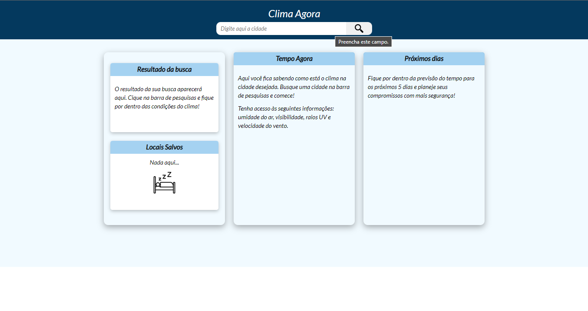
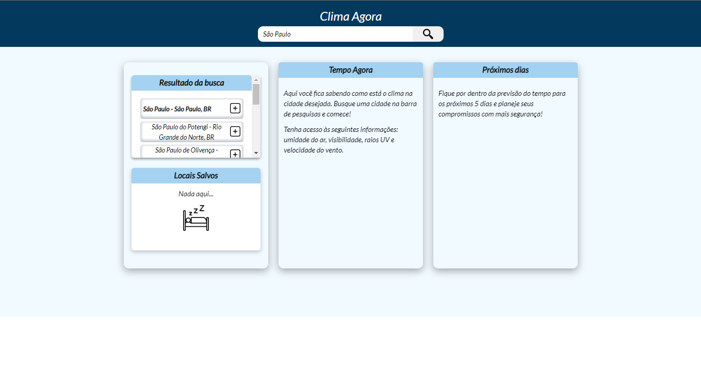
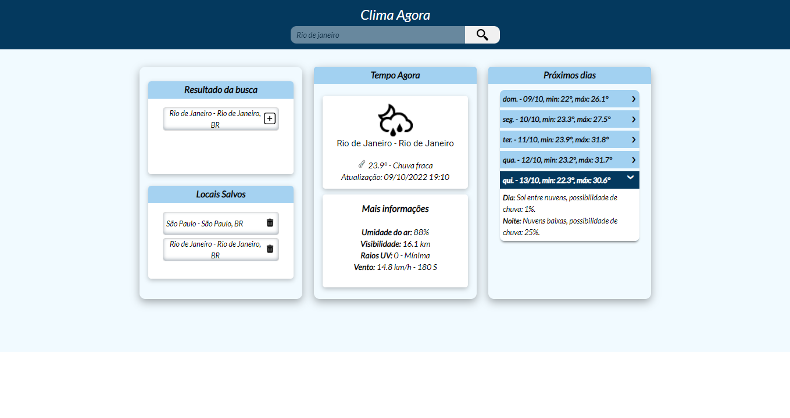

# App Previsão do tempo

#### Bem-Vindo! 👋

## Objetivo

Criar um aplicativo para consulta da previsão do tempo em uma determinada cidade, permitindo adicionar cidades aos locais favoritos para consumo posterior. O usuário tem acesso à diversas informações, como temperatura, umidade do ar, visibilidade etc.

## Índice:

  - [Visão Geral](#visao-geral)
  - [Screenshots](#screenshots)
  - [Tecnologias](#tecnologias)
  - [Aprendizado](#aprendizado)
  - [Autor](#autor)

# Visão Geral

### Deploy

- PROJETO - [App Previsão dp Tempo](https://nice-water-08b608410.2.azurestaticapps.net)

### Screenshots

##### Página inicial  

##### Realizando uma busca  

##### Previsão do tempo  

## Tecnologias

- HTML5
- CSS
- TypeScript
- [Angular](Angular - Introduction to the Angular Docs)
- [API Azure Maps](Azure Mapas visão geral | Microsoft Learn)

### Aprendizado

- Consumo de API usando TypeScript;
- Comunicação entre componentes Angular;
- Posicionamento dos elementos em tela.
- Criação de APP na Azure.

## Autor

- GitHub - [André Cruz](https://github.com/andreldcm989)
- LinkedIn - [André Cruz](https://www.linkedin.com/in/andreldcruz/)
